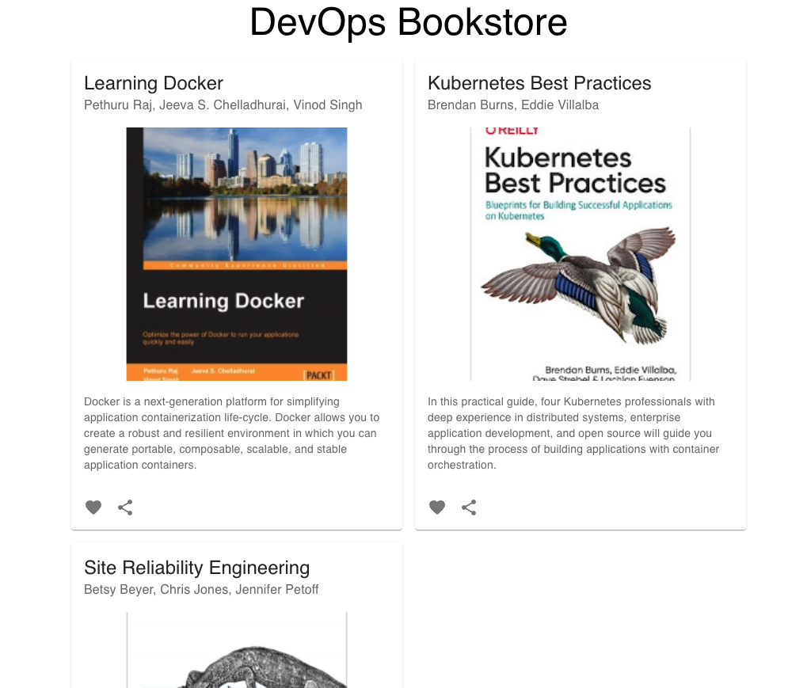

# Kubernetes - Multiple Applications

Let's explore further containerising and deploying further applications in Kubernetes.

## Scenario

In this scenario, imagine you are a cloud engineer supporting two teams

Team Frontend have created a [React](https://react.dev/) frontend application in JavaScript.

Team Backend have created a [Python Flask](https://flask.palletsprojects.com/en/2.3.x/) API

The frontend application has to communicate to the backend application.

It's your job to get the two applications running and talking to each other.

Firstly you will do this with Docker locally before later moving them to run on Kubernetes.

## Instructions

### Explore the code

It's worth exploring the code for the backend and frontend - as a cloud engineer, exploring code you haven't written is a whole other skill in itself.

Things to take note of might be Dockerfiles or aspects like ports being used.

### Get them running locally with Docker

Notice both applications have their own Dockerfile - we can use that to build the docker images.

As a tip, here is how you could go about building the backend as a docker image

```
docker build --platform linux/amd64 -t bookstore-backend-api:1.0 .
```

And here is a build command for the frontend:

```
docker build --platform linux/amd64 -t bookstore-frontend:1.0 .
```

Once built, you can start the backend using

```
docker run --platform linux/amd64 --rm -it -d -p 5050:5000 bookstore-backend-api:1.0
```

Assuming you've mapped port 5050 you could hit the backend API to see a list of books.

[http://localhost:5050/books](http://localhost:5050/books)

The frontend can also be started using Docker - it will communicate to the backend to get a list of books.

```
docker run --platform linux/amd64 --rm -it -d -p 8080:80 bookstore-frontend:1.0
```

**!!!BUT WAIT!!!** The frontend doesn't seem to be showing a list of books, when the team demo'd it earlier they shown you that it should like this image below:



It's your job to inspect the **frontend codebase** and work out why it isn't successfully hitting the backend API.

You'll need to fix the issue and build a new docker image

### **Teardown**

Before we move on, lets tear down any local versions we have of these images now.

Use `docker ps` to list your currently running containers and find the ones you just started up.

Use the NAME of the container on the far right of your terminal that corresponds with your front and back end containers to stop these containers from running.

`docker stop name_of_your_container`

_These names will be different for everyone._

Once you have run this command, the terminal will output the name of the container it has stopped so you can be sure its worked, although for peace of mind run `docker ps` once more to double check!

### Get things running in Kubernetes

Now you have proved things out and have them working locally in Docker it's time to take your containers and get them running in Kubernetes.

You'll see 4 files in the [kubernetes](./kubernetes/) directory.

Your job is to fill out the four files and get your applications working in Kubernetes.

Don't forget you will have to PUSH your container images up to Docker Hub in order for Kubernetes to know where to pull the images from.

**💡 HINT:** Your frontend should be configured to talk to the backend via the backend service. You shouldn't have to do any port mapping.

[DNS for Services and Pods](https://kubernetes.io/docs/concepts/services-networking/dns-pod-service/)

[Internal DNS Service in Kubernetes Environments](https://rancher.com/docs/rancher/v1.2/en/kubernetes/k8s-internal-dns-service/)

## Submission instructions

1. Fork this GitHub repository

2. Work through the instructions

3. Share the link to your GitHub repository
